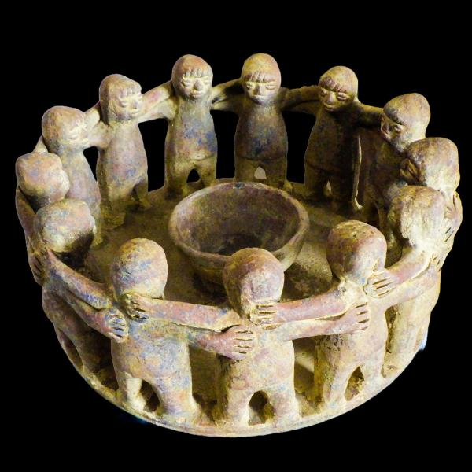

Rough idea:

**Theme: End of the world**

**Emotions: Inquiry > Curiosity > Dread > hopelessness > horror > Hope and Peace.**

### Twist:
> Helios is not actually a fuel, rather it's an extradimensional prison for a cosmic being.

**Questions to be made by the player (in order):**

_What? > When? > How? > Why?_

---

### Internal Plot:

Long before modern civilization, around late 14th century CE, during the rise of Aztec Empire,
the then king of Aztec, Acamapichtli organized an ancient ritual by a strange group of trained "priests".
While the usual priests of the Aztec empire (known as Tlamacazqui) engaged in animal sacrifices,
managed temples, taught in schools, and predicted the future, this group of priests were different.

When Acamapichtli came into power in 1376 CE he had one goal and one goal only-- make the Aztec emprire the greatest in the world.
A civilization whose name would be spoken for centuries to come.
Acacitli was a great advisor to Acamapichtli. Acamapichtli married his daughter who gave birth to their heir.

Acacitli was a great believer of Dark Magic and the supernatural.
He manipuated and convinced Acamapichtli to prepare a secretive ritual that roots back to unknown times.

This ritual was not simple and fast-- This ritual took precisely 20 years to complete.

> The ritual is a bit complex so I am dedicating another markdown for it.
> **[Click here](ritual.md)**

 
This is a real pottery from the Aztecs. The ritual is fake but this looks like it.
 
Source: 
<a href="https://www.mexicolore.co.uk/aztecs/artefacts/circle-of-friends-terracotta-figure" target="_blank">This</a> and
<a href="https://www.hemswell-antiques.com/antiques/decorative-antiques/mexican-terracotta-12-man-circle-of-friends-centre-piece-118224.html">That</a>

